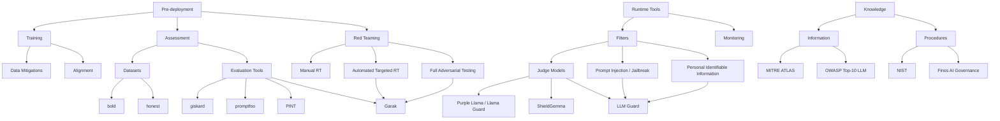

```mermaid
graph TD

  %% First layer
  A1[Pre-deployment]
  A2[Runtime Tools]
  A3[Knowledge]

  %% Pre-deployment subtree
  A1 --> B1[Training]
  A1 --> B2[Assessment]
  A1 --> B3[Red Teaming]

  B1 --> C1[Data Mitigations]
  B1 --> C2[Alignment]

  B2 --> C3[Datasets]
  B2 --> C4[Evaluation Tools]

  B3 --> C5[Manual RT]
  B3 --> C6[Automated Targeted RT]
  B3 --> C7[Full Adversarial Testing]

  %% Runtime Tools subtree
  A2 --> D1[Filters]
  A2 --> D2[Monitoring]

  D1 --> E1[Judge Models]
  D1 --> E2[Prompt Injection / Jailbreak]
  D1 --> E3[Personal Identifiable Information]

  %% Knowledge subtree
  A3 --> F1[Information]
  A3 --> F2[Procedures]

  %% Tool nodes
  G1[bold]
  G2[honest]
  G3[giskard]
  G4[promptfoo]
  G5[PINT]
  G6[Garak]
  G7[Purple Llama / Llama Guard]
  G8[ShieldGemma]
  G9[LLM Guard]
  G10[MITRE ATLAS]
  G11[OWASP Top-10 LLM]
  G12[NIST]
  G13[Finos AI Governance]

  %% Connect tools to categories

  %% Datasets
  C3 --> G1
  C3 --> G2

  %% Evaluation Tools
  C4 --> G3
  C4 --> G4
  C4 --> G5
  C4 --> G6

  %% Automated Targeted RT
  C6 --> G6

  %% Full Adversarial Testing
  C7 --> G6

  %% Judge Models
  E1 --> G7
  E1 --> G8
  E1 --> G9

  %% Prompt Injection / Jailbreak
  E2 --> G9

  %% PII
  E3 --> G9

  %% Information
  F1 --> G10
  F1 --> G11

  %% Procedures
  F2 --> G12
  F2 --> G13
```