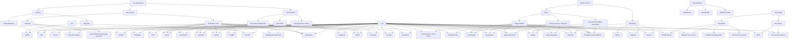

```mermaid
graph TD

  %% First layer
  A1[Pre-deployment]
  A2[Runtime Tools]
  A3[Knowledge]
  A4[ML]
  A5[LLM]
  A6[Miscellaneous]

  %% Pre-deployment subtree
  A1 --> B1[Training]
  A1 --> B2[Assessment]
  A1 --> B3[Red Teaming]

  B1 --> C1[Data Mitigations]
  B1 --> C2[Alignment]

  B2 --> C3[Datasets]
  B2 --> C4[Evaluation Tools]

  B3 --> C5[Manual RT]
  B3 --> C6[Automated Targeted RT]
  B3 --> C7[Full Adversarial Testing]

  %% Runtime Tools subtree
  A2 --> D1[Filters]
  A2 --> D2[Monitoring]

  D1 --> E1[Judge Models]
  D1 --> E2[Prompt Injection / Jailbreak]
  D1 --> E3[Personal Identifiable Information]

  %% Knowledge subtree
  A3 --> F1[Information]
  A3 --> F2[Procedures]

  %% Tool nodes
  G1[bold]
  G2[honest]
  G3[Giskard]
  G4[Promptfoo]
  G5[PINT]
  G6[Garak]
  G7[Purple Llama / Llama Guard]
  G8[ShieldGemma]
  G9[LLM Guard]
  G10[MITRE ATLAS]
  G11[OWASP Top-10 LLM]
  G12[NIST]
  G13[Finos AI Governance]
  G14[GuardrailsAI]
  G15[LLM Canary]
  G16[NeMo Guardrails]
  G17[AIF360]
  G18[LangKit]
  G19[InspectAI]
  G20[BrokenHill]
  G21[Couterfit]
  G22[Granite Guardian]
  G23[Vigil LLM]
  G24[Spikee]
  G25[FuzzyAI]
  G26[Dyana]
  G27[LangBit]
  G28[Langfuse]
  G29[Arize-ai]
  G30[Misalignment Anthropic]
  G31[DeepTeam]
  G32[HarmBench]
  G33[DeepEval]
  G34[PyRIT]
  G35[WhiteRabbit]
  G36[AIRTBenchmark]
  G37[TrustLLM]
  G38[CP Reference Architecture]
  G39[ProtectAI exploits]
  G40[OWASP AI testing guide]
  G41[Secure AI Framework]
  G42[joey-melo/owasp-aitg-app-payloads]

  %% LLM vs ML vs Miscellaneous

  A5 --> G1
  A5 --> G2
  A5 --> G3
  A5 --> G4
  A5 --> G5
  A5 --> G6
  A5 --> G7
  A5 --> G8
  A5 --> G9
  A5 --> G10
  A5 --> G11
  A5 --> G12
  A5 --> G13
  A5 --> G14
  A5 --> G15
  A5 --> G16
  A4 --> G17
  A5 --> G18
  A5 --> G19
  A5 --> G20
  A4 --> G21
  A5 --> G22
  A5 --> G23
  A5 --> G24
  A5 --> G25
  A5 --> G27
  A5 --> G28
  A5 --> G29
  A5 --> G30
  A5 --> G31
  A6 --> G32
  A5 --> G33
  A5 --> G34
  A6 --> G35
  A6 --> G36
  A5 --> G37
  A5 --> G38
  A5 --> G39

  %% Connect tools to categories

  %% Data mitigations
  C1 --> G17

  %% Datasets
  C3 --> G1
  C3 --> G2
  C3 --> G39
  C3 --> G42

  %% Evaluation Tools
  C4 --> G3
  C4 --> G4
  C4 --> G5
  C4 --> G6
  C4 --> G15
  C4 --> G19
  C4 --> G24
  C4 --> G27
  C4 --> G17
  C4 --> G21
  C4 --> G30
  C4 --> G31
  C4 --> G33
  C4 --> G34
  C4 --> G37

  %% Automated Targeted RT
  C6 --> G6
  C6 --> G19
  C6 --> G24
  C6 --> G25
  C6 --> G31
  C6 --> G34

  %% Full Adversarial Testing
  C7 --> G6
  C7 --> G20
  C7 --> G31

  %% Monitoring
  D2 --> G18
  D2 --> G26
  D2 --> G28
  D2 --> G29

  %% Judge Models
  E1 --> G7
  E1 --> G8
  E1 --> G9
  E1 --> G14
  E1 --> G16
  E1 --> G18
  E1 --> G22
  E1 --> G23
  E1 --> G38

  %% Prompt Injection / Jailbreak
  E2 --> G9
  E2 --> G14
  E2 --> G16
  E2 --> G22
  E2 --> G23
  E2 --> G38

  %% PII
  E3 --> G9
  E3 --> G38

  %% Information
  F1 --> G10
  F1 --> G11
  F1 --> G40
  F1 --> G41

  %% Procedures
  F2 --> G12
  F2 --> G13
```